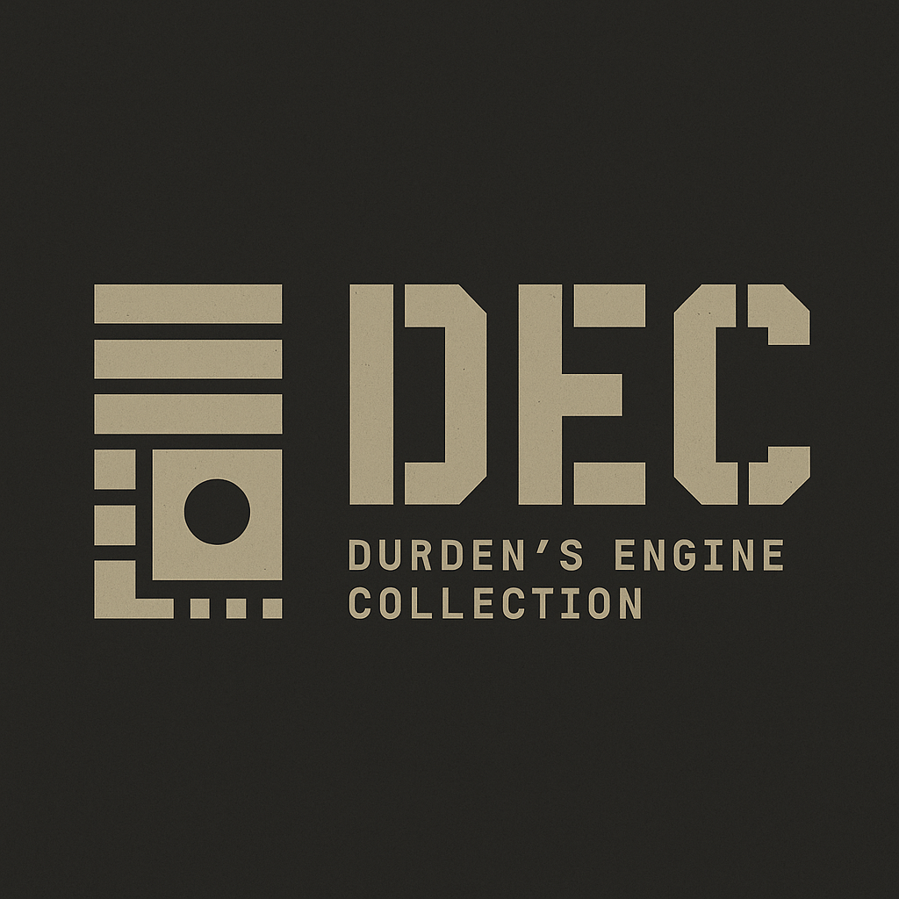

# DURDEN'S ENGINE COLLECTION

## 1. Introduction

Greetings readers! I am **Gourav**, and started ***DEC*** (formly **Maltose**) as an open-source project with aim of creating an assembler having intuitive syntax for assembly programmers, now with plan to scale it as complete **source-to-memory** toolchain. Current focus is limited to **x86 processors**. I know it is not going to be made immediately or easily, which resonates with most of the quality engineering pieces. I have tried to keep the documents as descriptive & clear as possible. Still for any doubt, you can reach me out through the links given in the **7th** section.

All directories on this repositary have their own `README` file in `README ({path-to-dir}).md` format. This primarily explains the role of files & directories in that particular directory, which can help readers navigate easily through their desired focus area. While for parent/root directory, the information of its files & directories are mentioned in next section (**section 2**).

## 2. Features

- Intuitive syntax grammar
- Focused on portability
- Compatible with GCC & LLVM

## 3. System Requirements

- **<u>Processor</u>:** Intel/AMD (for now)
- **<u>Platform</u>:** Linux (any distro)
- **<u>RAM</u>:** ?
- **<u>Space</u>:** ?

## 4. Directory Structure

- `assets/` - Contains images, media & readable materials.
- `docs/` - Contains all the documentation.
- `misc/` - Contains miscellaneous files which aren't very important.
- `test/` - Contains each pilot run & unit test directory.

## 5. Installation

*\*Coming soon...*

## 6. Licensing & Ethics

DEC is licensed under the **Apache 2.0 License** (see [LICENSE](./LICENSE)). However, please read [ETHICS.md](./ETHICS.md) for important moral guidelines about how this software should and should not be used.

This project is an attempt to build tools, not weapons. You are trusted to honor that.

## 7. Personal Information

For anyone willing to connect with me, I am more than happy to connect back.

- [Gmail](guduthestriker11@gmail.com)
- [LinkedIn](www.linkedin.com/in/gourav-kumar-mallick-272715250)
- [DailyDev](https://dly.to/80nfgMfHYvP)
- [GitHub](https://github.com/Gourav-334) (lol, ofcourse)

---